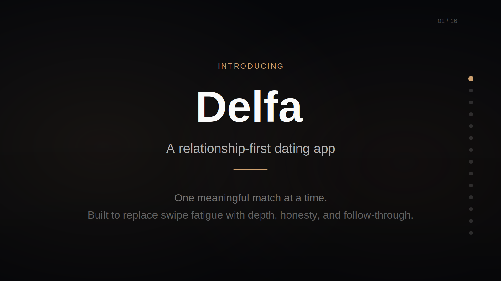

# Delfa

Delfa is a relationship-first dating app designed to replace swipe fatigue with one high-quality match at a time.

[](https://builtbylee.github.io/Delfa/presentations/delfa-explainer-deck.html)

[Open Interactive Deck](https://builtbylee.github.io/Delfa/presentations/delfa-explainer-deck.html)

## Core Product Principles

- One active match at a time
- Progressive profiling instead of a long upfront questionnaire
- Data-backed compatibility focused on long-term relationship outcomes
- Graceful disconnects instead of ghosting
- Incentives for effort, honesty, and follow-through

## Repository Structure

```text
.
├── .github/
│   ├── ISSUE_TEMPLATE/
│   └── PULL_REQUEST_TEMPLATE.md
├── apps/
│   ├── api/
│   └── mobile/
├── docs/
│   ├── product/
│   └── research/
├── packages/
│   └── shared/
├── CHANGELOG.md
├── CLAUDE.md
├── ISSUES.md
├── README.md
├── RELEASE_MANIFEST.md
└── TECHNICAL_MANUAL.md
```

## Documentation

- `README.md`: repo overview and working conventions
- `TECHNICAL_MANUAL.md`: product and architecture blueprint
- `docs/product/profiler-v1.md`: first structured profiler spec and question architecture
- `docs/product/profiler-question-bank-v1.md`: canonical question wording and answer inventory
- `docs/product/profiler-schema-v1.md`: canonical profiler question schema and response rules
- `docs/product/profiler-data-model-v1.md`: profiler persistence and domain-model draft
- `docs/product/profiler-scoring-v1.md`: compatibility-scoring draft for V1
- `docs/product/profiler-user-flows-v1.md`: implementation-ready profiler UX flows
- `docs/product/match-experience-v1.md`: core match-stage differentiators and interaction design direction
- `docs/presentations/delfa-explainer-deck-v1.md`: explainer deck source covering Delfa's product direction and architecture
- [`docs/presentations/delfa-explainer-deck.html`](docs/presentations/delfa-explainer-deck.html): GitHub Pages-ready interactive explainer deck
- `docs/research/market-and-relationship-research.md`: evidence base for product and profiler decisions
- `docs/research/dating-app-strengths.md`: verified strengths from current dating apps worth adapting for Delfa
- `CHANGELOG.md`: chronological project changes
- `ISSUES.md`: current product and engineering backlog
- `RELEASE_MANIFEST.md`: release scope and version tracking
- `CLAUDE.md`: project context and recently completed work

## Shared Implementation

- `packages/shared/src/profiler/types.ts`: canonical profiler domain types
- `packages/shared/src/profiler/question-bank.ts`: shared section/question definitions derived from the profiler docs
- `packages/shared/src/profiler/contracts.ts`: API request and response contracts for profiler flows
- `packages/shared/src/index.ts`: shared package export surface

## Initial Scope

This repository now has a documentation-first foundation plus an initial shared profiler implementation layer. The next implementation phase should wire these shared contracts into `apps/api` and `apps/mobile`.
